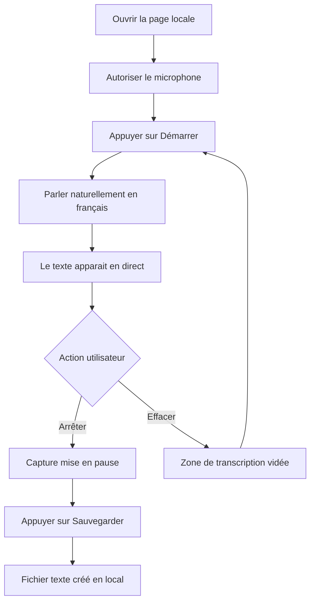

# Application Web Locale de Journal Audio - Spécifications MOA

## 1. Intention produit

Concevoir une application web locale qui permette à l'utilisateur de parler au lieu d'écrire, de voir une transcription en direct dans une zone de texte de type console dans le navigateur, puis d'enregistrer chaque capture sous forme de fichier texte horodaté.

La priorité de la V1 est la capture du microphone uniquement.

La capture du son système entrant et sortant, à la manière de OBS Studio, est explicitement considérée comme une extension ultérieure.

La langue audio cible de la V1 est le français.

## 2. Vision produit

L'application agit comme un journal vocal quotidien personnel :

- une page locale s'ouvre dans le navigateur
- l'utilisateur clique sur Démarrer pour commencer l'écoute
- les paroles apparaissent en direct dans une zone de texte
- l'utilisateur clique sur Arrêter pour mettre fin à l'écoute
- l'utilisateur peut effacer le texte courant si nécessaire
- l'utilisateur peut sauvegarder le texte dans un fichier horodaté tel que 2026-03-22_17h53_OrenHome.txt

## 3. Utilisateur cible

Utilisateur principal :

- une seule personne utilisant un ordinateur Windows en local
- souhaite documenter ses pensées, activités ou réflexions quotidiennes à la voix
- préfère la simplicité à une richesse fonctionnelle excessive
- attend de la confidentialité et un usage fluide

## 4. Périmètre V1

### Inclus dans la V1

- interface web locale hébergée sur localhost
- demande d'autorisation du microphone
- bouton Démarrer
- bouton Arrêter
- zone de transcription en direct
- bouton Effacer pour vider la transcription courante
- bouton Sauvegarder pour créer un fichier texte nommé avec horodatage
- stockage local sur la machine
- indicateur d'état montrant inactif, en écoute ou arrêté
- messages d'erreur simples si l'accès micro échoue ou si la transcription est indisponible
- reconnaissance vocale configurée en français

### Exclu de la V1

- capture du son système
- capture simultanée microphone plus haut-parleurs
- diarisation des locuteurs
- historique intégré
- recherche dans les anciennes notes
- tags et catégories dans l'interface
- synchronisation cloud
- prise en charge mobile comme priorité
- archivage audio comme fonction de premier niveau

## 5. Parcours utilisateur principal

## 6. Exigences fonctionnelles

### 6.1 Écran principal

L'application doit présenter un seul écran centré sur l'usage contenant :

- une grande zone de transcription avec une lisibilité type console
- un bouton Démarrer
- un bouton Arrêter
- un bouton Effacer
- un bouton Sauvegarder
- une zone visible d'état de capture
- un aperçu visible du nom de fichier courant

### 6.2 Capture et transcription

Exigences :

- l'utilisateur peut démarrer l'écoute du microphone manuellement
- l'utilisateur peut arrêter l'écoute manuellement
- la transcription apparait progressivement pendant que l'utilisateur parle
- le texte intermédiaire peut être affiché, mais le texte final reconnu doit rester lisible et stable
- lorsque l'écoute est arrêtée, aucun nouveau texte ne doit être ajouté
- si le microphone est indisponible, l'application doit afficher un message bloquant clair
- la langue de reconnaissance doit être réglée sur le français

### 6.3 Comportement de la zone de transcription

Exigences :

- le texte apparait dans l'ordre chronologique
- le texte le plus récent reste visible automatiquement
- la zone permet une correction manuelle avant sauvegarde
- pendant l'écoute, l'édition manuelle reste autorisée sur l'ensemble du texte, selon la préférence exprimée pour la V1
- la transcription doit être structurée en blocs successifs clairement séparés pour permettre l'ajout d'un horodatage lisible avant chaque bloc
- un nouveau bloc de transcription est créé à chaque pause vocale détectée
- le bouton Effacer vide uniquement la transcription non sauvegardée après confirmation explicite
- l'effacement ne supprime jamais les fichiers déjà sauvegardés

### 6.4 Comportement de la sauvegarde

Exigences :

- le bouton Sauvegarder écrit la transcription courante dans un fichier texte local
- le format du nom de fichier doit suivre la date et l'heure plus le suffixe utilisateur, par exemple 2026-03-22_17h53_OrenHome.txt
- le contenu sauvegardé doit inclure un horodatage avant chaque bloc de transcription
- l'action de sauvegarde doit confirmer visiblement le succès
- si la transcription est vide, la sauvegarde doit être bloquée ou demander confirmation
- la sauvegarde ne stoppe pas nécessairement la capture, sauf choix explicite du design produit
- en V1, la sauvegarde utilise un dossier fixe par défaut ; ce dossier pourra devenir configurable dans une version ultérieure
- le dossier fixe par défaut retenu est `D:\Documents\PersOren\Programmation\ChatGPT\2026-03-22 AudioListener\History`
- chaque clic sur Sauvegarder crée systématiquement un nouveau fichier horodaté distinct

### 6.5 Convention de nommage

Modèle recommandé pour la V1 :

- AAAA-MM-JJ_HHhMM_OrenHome.txt

Règles :

- la date utilise la date locale de la machine
- l'heure utilise l'heure locale de la machine au format 24 heures
- aucun espace dans les noms de fichiers
- le suffixe utilisateur restera configurable dans une version ultérieure
- chaque bloc de transcription enregistré dans le contenu est précédé d'un horodatage lisible
- si plusieurs sauvegardes ont lieu dans la même minute, un suffixe technique `_01`, `_02`, etc. peut être ajouté pour garantir l'unicité du fichier sans écraser le précédent

Exemples :

- 2026-03-22_17h53_OrenHome.txt
- 2026-03-22_21h08_OrenHome.txt

Exemple de contenu :

- [17:53] Bonjour, je commence mon journal.
- [17:56] Je viens de rentrer à la maison.

Format d'horodatage retenu pour la V1 dans le contenu :

- [HH:MM] avant chaque bloc de transcription

Règle de découpage retenue pour la V1 :

- un nouveau bloc commence à chaque pause vocale détectée

## 7. Recommandations MOA pour rendre l'application pratique

Même avec une V1 très ciblée, le produit devrait inclure les décisions pratiques suivantes.

### Choix produit obligatoires pour la V1

- expérience sur un seul écran pour réduire la friction
- très grands boutons Démarrer et Arrêter pour un usage immédiat
- thème sombre ou mode de lecture à fort contraste pour le confort de journalisation
- zone de transcription modifiable avant sauvegarde, y compris pendant l'écoute si l'utilisateur souhaite corriger au fil de l'eau
- information visible sur l'emplacement de sauvegarde, avec affichage du dossier `D:\Documents\PersOren\Programmation\ChatGPT\2026-03-22 AudioListener\History`
- confirmation avant action destructive sur Effacer
- mention explicite de confidentialité indiquant que la transcription vise à rester locale
- indication visible que la reconnaissance vocale fonctionne en français

### Améliorations UX recommandées

- désactiver Démarrer pendant une écoute déjà active
- désactiver Arrêter quand l'application est déjà arrêtée
- désactiver Sauvegarder si aucun contenu significatif n'est présent
- afficher un petit indicateur d'enregistrement pendant l'écoute
- afficher l'heure de la dernière sauvegarde réussie
- afficher un compteur de mots ou de caractères dans l'interface

## 8. Exigences non fonctionnelles

### 8.1 Confidentialité

- l'architecture cible doit privilégier un traitement local
- aucun compte utilisateur n'est requis
- aucune dépendance cloud ne doit être obligatoire dans la solution recommandée
- la V1 retenue doit fonctionner hors ligne pour la transcription une fois les dépendances locales installées
- le flux audio du microphone ne doit pas être envoyé à un service tiers pour produire la transcription V1
- si un moteur non local est un jour proposé, l'interface doit l'indiquer clairement

### 8.2 Fiabilité

- Démarrer et Arrêter doivent se comporter de manière prévisible à chaque utilisation
- l'interface doit rester exploitable pendant une dictée continue
- Sauvegarder doit éviter tout échec silencieux
- les erreurs doivent être compréhensibles par un utilisateur non technique

### 8.3 Performance

- la transcription doit apparaitre avec un délai perçu minimal
- l'application doit rester réactive pendant les longues notes
- l'interface doit supporter au minimum des sessions prolongées de journalisation sans se figer

### 8.4 Utilisabilité

- la première utilisation doit nécessiter un minimum de configuration
- l'interface doit être compréhensible en moins d'une minute
- l'accessibilité clavier est souhaitable même si ce n'est pas la priorité initiale

### 8.5 Conservation des données

- les fichiers sauvegardés restent en texte brut pour une portabilité durable
- le produit ne doit pas enfermer les notes dans un format propriétaire
- l'emplacement de stockage doit être facile à sauvegarder manuellement

## 9. Options de solution à haut niveau

### Option A - transcription vocale native du navigateur en priorité

Description :

- utiliser les capacités de reconnaissance vocale du navigateur lorsqu'elles sont disponibles
- offrir le chemin le plus rapide vers un prototype utilisable

Avantages :

- expérience utilisateur la plus simple
- effort d'implémentation plus léger
- idéal pour valider rapidement l'utilité du produit

Contraintes :

- la compatibilité navigateur et la qualité de transcription peuvent varier
- les garanties de confidentialité peuvent dépendre du navigateur
- le comportement peut différer selon l'environnement

### Option B - moteur de transcription local derrière une interface web localhost

Description :

- utiliser un service local sur Windows pour convertir la parole en texte et exposer les résultats à la page locale
- l'implémentation V1 retenue s'appuie sur un backend localhost et un moteur de transcription hors ligne de type faster-whisper

Avantages :

- positionnement confidentialité plus solide
- architecture plus maitrisable
- meilleure base à long terme pour les évolutions comme la capture du son système
- fonctionnement possible sans dépendance de transcription côté navigateur

Contraintes :

- mise en place plus complexe
- davantage de composants qu'une approche purement navigateur
- performance et latence dépendantes du modèle retenu et de la puissance de la machine locale

### Cible recommandée

Pour votre besoin exprimé, la meilleure recommandation MOA est la suivante :

- valider le produit avec une V1 très ciblée
- conserver une interface sous forme de page web localhost
- prioriser uniquement la capture microphone
- retenir dès la V1 une architecture de transcription locale hors ligne via un backend localhost et un moteur de type faster-whisper
- ne pas dépendre de la reconnaissance native du navigateur pour la transcription principale de la V1

Cette recommandation équilibre simplicité, confidentialité et extensibilité future.

## 10. Feuille de route après la V1

### Fonctionnalités candidates pour la V2

- autosauvegarde de brouillon
- reprise de la même note plus tard dans la journée
- séparateurs de session dans un même fichier journal
- horodatage par paragraphe ou bloc de parole
- copie rapide dans le presse-papiers
- suffixe configurable tel que Home, Work ou Car

### Fonctionnalités candidates pour la V3

- panneau d'historique local
- recherche dans les fichiers des jours précédents
- dossiers par jour ou par mois
- export markdown
- génération optionnelle de résumé

### Feuille de route avancée

- capture du son système à la manière de OBS Studio
- transcription mixée microphone plus son système
- sélection du périphérique en cas de plusieurs microphones
- raccourcis clavier pour Démarrer, Arrêter, Sauvegarder
- archivage audio lié à la transcription

## 11. Règles de gestion

- le produit doit toujours exiger une action explicite de l'utilisateur pour démarrer l'écoute
- le produit ne doit jamais écouter silencieusement en arrière-plan par défaut
- le produit ne doit jamais effacer des fichiers déjà sauvegardés via le bouton Effacer
- le nom du fichier sauvegardé doit toujours contenir un horodatage
- l'interface doit rendre l'état d'écoute évident

## 12. Critères d'acceptation de la V1

La V1 est acceptable lorsque les éléments suivants sont vrais :

- l'utilisateur peut ouvrir une page locale et comprendre immédiatement l'interface
- l'utilisateur peut autoriser le microphone et démarrer la transcription manuellement
- la parole apparait en direct dans la zone de texte
- Arrêter bloque toute nouvelle saisie de texte
- Effacer vide uniquement la transcription non sauvegardée après confirmation
- Sauvegarder crée un fichier texte nommé selon la convention d'horodatage attendue
- le fichier obtenu peut être ouvert dans un éditeur de texte classique

## 13. Backlog prêt pour une phase ultérieure de réalisation

### Épopée 1 - Interface locale de journalisation

- définir la mise en page mono-écran
- définir les états des boutons Démarrer, Arrêter, Effacer, Sauvegarder
- définir les règles de la zone de transcription et du défilement
- définir les messages d'état et les états vides

### Épopée 2 - Flux de capture microphone

- définir le comportement de demande d'autorisation et de refus
- définir la machine d'état d'écoute
- définir le rafraichissement de la transcription en direct
- définir le comportement en état arrêté
- définir explicitement la configuration de langue audio en français
- définir la règle de détection des pauses vocales déclenchant un nouveau bloc

### Épopée 3 - Sauvegarde et gestion de fichiers

- définir la logique de nommage horodaté
- définir la stratégie d'emplacement de sauvegarde avec dossier fixe par défaut en V1 dans `D:\Documents\PersOren\Programmation\ChatGPT\2026-03-22 AudioListener\History`
- définir la règle de création systématique d'un nouveau fichier à chaque sauvegarde
- définir le format d'horodatage affiché avant chaque bloc de transcription dans le contenu
- définir les notifications de succès et d'échec
- définir les règles de sauvegarde d'une transcription vide

### Épopée 4 - Robustesse produit

- définir la confirmation d'action destructive pour Effacer
- définir les attentes de stabilité sur session longue
- définir le texte de confidentialité dans l'interface
- définir les scénarios minimums de test du microphone et de la sauvegarde

### Épopée 5 - Préparation de l'après V1

- évaluer les options de moteur de transcription local
- évaluer la faisabilité de la capture du son système sur Windows
- définir les points d'extension pour de futurs modules d'historique et de recherche

## 14. Décisions produit recommandées immédiatement

Pour éviter toute ambiguïté pendant la future implémentation, les décisions suivantes devraient être figées dès maintenant :

- la V1 capture uniquement le microphone
- la V1 est une application web localhost
- la V1 s'appuie sur un backend local pour la transcription et la sauvegarde de fichiers
- la V1 utilise une transcription hors ligne de type faster-whisper comme moteur cible
- la V1 comporte quatre commandes principales : Démarrer, Arrêter, Effacer, Sauvegarder
- la V1 affiche une transcription en direct dans une grande zone de texte éditable, y compris pendant l'écoute
- la V1 sauvegarde des fichiers texte simples avec un nom horodaté comme 2026-03-22_17h53_OrenHome.txt
- la V1 sauvegarde dans le dossier fixe `D:\Documents\PersOren\Programmation\ChatGPT\2026-03-22 AudioListener\History` ; ce choix pourra devenir configurable plus tard
- la V1 crée un nouveau fichier horodaté à chaque clic sur Sauvegarder
- la V1 insère un horodatage dans le contenu avant chaque bloc de transcription
- la V1 crée un nouveau bloc à chaque pause vocale détectée
- la langue audio de la V1 est le français
- les fonctionnalités avancées sont renvoyées à la feuille de route et non à la V1

## 15. Décisions ouvertes à valider avant codage

- seuil exact de détection d'une pause vocale avant création d'un nouveau bloc
- taille de modèle local à retenir pour faster-whisper selon le compromis vitesse et précision sur la machine cible

## 16. Prochaine étape recommandée

Utiliser cette spécification comme base d'un plan V1 léger, puis implémenter uniquement le périmètre V1 figé avec transcription locale hors ligne avant d'évaluer les éléments de feuille de route.
