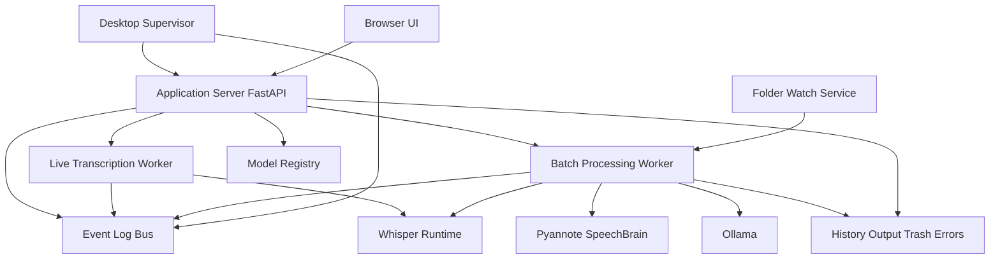

# Proposition d’architecture de fusion

## 1. Résumé exécutif

La meilleure base long terme n’est ni une simple greffe du projet monolithique, ni la conservation stricte du projet actuel tel quel.

La proposition cible est la suivante :

- garder la base web/API modulaire du projet actuel pour l’interface navigateur, les WebSocket et l’évolutivité
- absorber les capacités riches du projet Whisper by Gemini dans des services spécialisés découplés
- introduire un processus de supervision desktop qui pilote les services, expose un systray Windows et centralise l’état global
- unifier les logs via un bus d’événements consultable à la fois dans le navigateur et dans les logs fichiers

En pratique, l’architecture cible devient un système à 3 couches :

1. `Desktop Supervisor` pour le systray, le démarrage, le monitoring et le pilotage local
2. `Application Server` pour l’API navigateur, le WebSocket live, les logs, les modèles et les commandes
3. `Processing Workers` pour les pipelines live et batch avec Whisper, Pyannote, SpeechBrain, Ollama et FFmpeg

## 2. Lecture profonde des deux projets

### Projet actuel

Forces observées dans [`app/main.py`](../app/main.py), [`app/transcription.py`](../app/transcription.py), [`app/storage.py`](../app/storage.py), [`app/ollama.py`](../app/ollama.py), [`static/index.html`](../static/index.html) et [`static/app.js`](../static/app.js)

- architecture déjà découpée entre config, API, transcription, stockage et UI
- interface navigateur propre et moderne avec zone de transcription, IA locale et logs techniques
- WebSocket temps réel déjà en place pour la capture micro et les retours debug
- sélection de modèle Whisper déjà exposée via API
- intégration Ollama déjà découplée côté backend
- surface technique raisonnable pour une future extension

Limites observées

- pipeline centré sur le live microphone, pas sur le batch surveillé
- pas de systray ni de superviseur Windows
- pas de surveillance de dossiers ni de file de traitement robuste
- pas de diarisation, biométrie, HTML luxe, correction magique ou ETA avancé
- logs orientés session WebSocket, pas encore pensés comme un flux système global
- dépendances actuelles incompatibles avec la pile Pyannote décrite, notamment [`requirements.txt`](../requirements.txt)

### Projet Whisper by Gemini

Forces observées dans [`../2026-02-01 Whisper by Gemini/main.py`](../2026-02-01%20Whisper%20by%20Gemini/main.py) et [`../2026-02-01 Whisper by Gemini/fonctionnalites.txt`](../2026-02-01%20Whisper%20by%20Gemini/fonctionnalites.txt)

- couverture fonctionnelle très large
- systray Windows déjà pensé comme cockpit local
- watchdog + scanner périodique + queue unitaire pour le batch de fichiers
- pipeline complet Whisper + Pyannote + SpeechBrain + Ollama + FFmpeg
- état global centralisé avec ETA, services, pause, statut et fichier en cours
- logique de validation démarrage très poussée
- HTML interactif avec correction magique locale

Limites observées

- monolithe de très grande taille dans [`main.py`](../2026-02-01%20Whisper%20by%20Gemini/main.py)
- très forte dette de maintenance car UI, services, worker, startup, logs et infra sont mêlés
- couplage fort à l’état global mutable
- présence de patchs système critiques utiles mais difficilement testables dans un script unique
- peu favorable à l’exposition propre d’une interface navigateur riche et extensible

## 3. Décision d’architecture

### Ce qu’il faut conserver du projet actuel

- serveur FastAPI
- WebSocket pour le live microphone
- frontend navigateur comme interface principale opérateur
- structuration modulaire Python
- sélection de modèles et appels IA par API

### Ce qu’il faut absorber du projet Whisper by Gemini

- systray Windows et supervision locale
- surveillance de dossiers et file batch série
- validation d’environnement très stricte au démarrage
- pipeline batch enrichi avec diarisation, biométrie, catégorisation, résumé, actions et rapports HTML
- correction magique locale sur rapport HTML
- instrumentation système détaillée avec ETA et états de services

### Ce qu’il faut éviter

- recréer un seul énorme fichier serveur
- exposer directement le worker batch dans le thread FastAPI
- mélanger les logs UI avec les logs système au niveau du simple `print`
- multiplier les points de vérité pour l’état courant

## 4. Architecture cible proposée

## 5. Modules cibles

### A. Noyau applicatif

Créer un noyau commun responsable des contrats, de la configuration et des événements.

Modules proposés :

- `app/core/config.py`
- `app/core/logging.py`
- `app/core/events.py`
- `app/core/state.py`
- `app/core/models.py`

Responsabilités :

- charger et valider toutes les variables `.env`
- fournir un état unifié du système
- publier des événements normalisés
- centraliser les enums de statuts et les structures de jobs

### B. Serveur applicatif

Conserver FastAPI comme façade de contrôle.

Modules proposés :

- `app/api/main.py`
- `app/api/routes/live.py`
- `app/api/routes/batch.py`
- `app/api/routes/models.py`
- `app/api/routes/logs.py`
- `app/api/routes/system.py`
- `app/api/ws/live.py`
- `app/api/ws/logs.py`

Responsabilités :

- UI navigateur
- WebSocket live transcription
- WebSocket ou SSE pour logs temps réel
- endpoints d’état, queue, jobs, modèles, configuration, pause et reprise
- passerelle vers le superviseur et les workers

### C. Superviseur desktop

Le systray doit devenir un vrai superviseur local, séparé de l’API mais connecté à elle.

Modules proposés :

- `app/desktop/systray.py`
- `app/desktop/supervisor.py`
- `app/desktop/process_control.py`
- `app/desktop/icon_factory.py`

Responsabilités :

- lancer et surveiller les services locaux
- ouvrir racine, logs, input, output
- afficher statut global, fichier courant, ETA, pause et reprise
- démarrer Ollama et OBS si nécessaires
- redémarrage contrôlé si un worker tombe

### D. Services de traitement

Séparer les traitements en services spécialisés.

Modules proposés :

- `app/services/live_transcription.py`
- `app/services/batch_watch.py`
- `app/services/job_queue.py`
- `app/services/media_intake.py`
- `app/services/reporting.py`
- `app/services/correction_api.py`

Responsabilités :

- live microphone
- scan initial et watchdog
- sérialisation stricte des jobs batch
- conversion média, stabilité, verrouillage Windows
- génération HTML TXT MP3 et statistiques
- correction intelligente des rapports HTML

### E. Runtimes IA

Encapsuler chaque moteur derrière une interface stable.

Modules proposés :

- `app/runtimes/whisper_runtime.py`
- `app/runtimes/diarization_runtime.py`
- `app/runtimes/biometrics_runtime.py`
- `app/runtimes/ollama_runtime.py`
- `app/runtimes/ffmpeg_runtime.py`
- `app/runtimes/hf_assets.py`

Responsabilités :

- chargement persistant des modèles
- fallback GPU CPU pour Whisper
- Pyannote CPU isolé
- SpeechBrain préchargé avec assets téléchargés manuellement
- patchs Windows et patchs torchaudio regroupés dans un bootstrap technique dédié

## 6. Choix structurel clé

### Un seul processus ou plusieurs

Je recommande un compromis propre :

- un processus principal `supervisor` pour le systray et la coordination locale
- un processus `api` pour FastAPI et l’UI navigateur
- un processus `worker` pour le batch et les runtimes lourds
- éventuellement le live dans le processus API au début, puis extraction ultérieure si charge élevée

Pourquoi ce choix est meilleur que le monolithe :

- le systray ne dépend pas de la santé du pipeline lourd
- le serveur web reste réactif pendant une diarisation ou un appel Ollama long
- les crashs d’un runtime IA sont mieux confinés
- les logs deviennent plus simples à classer par source

## 7. Flux fonctionnels cibles

### Flux 1 — Live navigateur

1. le navigateur ouvre [`/`](../app/main.py)
2. l’UI charge les modèles et l’état système
3. le client ouvre un WebSocket live
4. l’utilisateur choisit un modèle Whisper
5. les chunks audio partent vers le service live
6. les événements `partial`, `final`, `debug` et `status` reviennent au navigateur
7. le navigateur peut ensuite lancer résumé, reformulation ou actions via Ollama

### Flux 2 — Batch surveillé

1. le superviseur démarre le watcher
2. le watcher détecte ou rescane les dossiers Input
3. un job normalisé entre dans une queue série
4. le worker valide stabilité et verrouillage
5. conversion vers WAV 16 kHz mono
6. transcription Whisper
7. diarisation Pyannote
8. biométrie SpeechBrain pour Oren
9. enrichissement Ollama
10. génération des fichiers HTML TXT MP3 stats
11. publication d’événements de progression et de fin
12. affichage des logs à la fois dans le systray et dans le navigateur

### Flux 3 — Logs temps réel navigateur

Je recommande de ne plus utiliser uniquement les messages debug du WebSocket live.

À la place :

- chaque service publie des événements dans un `Event Log Bus`
- ces événements sont persistés en fichier et en mémoire tampon bornée
- le navigateur se connecte à un WebSocket `logs`
- le systray lit la même source d’état synthétique

Résultat : une seule vérité pour les logs et les statuts.

## 8. Fonctions à exposer dans le navigateur

L’interface navigateur doit devenir le cockpit principal.

### Écrans recommandés

1. `Live` pour la capture micro et la transcription instantanée
2. `Queue` pour les jobs batch surveillés
3. `Reports` pour les rapports HTML générés
4. `Logs` pour les logs temps réel filtrables
5. `Models` pour Whisper et Ollama
6. `System` pour services, chemins, état matériel et configuration

### Capacités minimales à prévoir

- choix du modèle Whisper pour le live
- choix du modèle Ollama pour les tâches IA
- visibilité du modèle actif dans le batch
- bouton pause et reprise de la queue
- affichage du job courant, de la prochaine ETA et des erreurs critiques
- consultation des logs filtrés par source et niveau
- accès direct aux rapports et réouverture du dossier output

## 9. Traitement des logs

Le point d’architecture le plus important pour réussir la fusion est le système de logs.

### Proposition

Introduire trois niveaux complémentaires :

- `Structured event log` pour les événements machine lisibles
- `Human server log` pour le diagnostic exhaustif sur disque
- `UI activity stream` pour le navigateur et le systray

Chaque événement doit porter :

- timestamp
- source
- job_id si applicable
- level
- code facultatif
- message humain
- payload optionnel

Exemples de sources :

- `supervisor`
- `api`
- `live`
- `watcher`
- `queue`
- `whisper`
- `diarization`
- `biometrics`
- `ollama`
- `reporting`

## 10. Gestion des modèles

### Whisper

- garder la sélection de modèles du projet actuel pour le live
- fixer un modèle dédié ou prioritaire pour le batch si nécessaire
- introduire un `Model Registry` qui sépare
  - modèles disponibles
  - modèle live courant
  - modèle batch courant
  - état chargé ou non

### Ollama

- lister les modèles locaux comme aujourd’hui
- permettre un choix par usage
  - résumé
  - actions
  - réécriture
  - mapping interlocuteurs
  - suffixe de nommage

### Pyannote et SpeechBrain

- pas de choix utilisateur fréquent dans l’UI
- exposition seulement de l’état de santé, version, cache et readiness

## 11. Compatibilités et risques techniques

### Risques de dépendances

Le conflit majeur vient de la pile IA.

- le projet actuel utilise une pile légère autour de [`faster-whisper`](../requirements.txt)
- le projet Gemini impose une pile Pyannote et SpeechBrain beaucoup plus sensible
- la compatibilité de [`numpy==2.2.4`](../requirements.txt:4) est un drapeau rouge face aux contraintes de [`fonctionnalites.txt`](../2026-02-01%20Whisper%20by%20Gemini/fonctionnalites.txt)

### Risques de couplage runtime

- Pyannote CPU et Whisper GPU doivent être isolés proprement
- les patchs torchaudio et `torch.load` doivent vivre dans un bootstrap ciblé, pas dans tout le serveur web
- les appels Ollama longs ne doivent pas bloquer l’API temps réel

### Risques UX

- le navigateur peut devenir trop chargé si on mélange live, batch, logs et rapports sur un seul écran
- il faut donc une navigation en vues distinctes, pas seulement une page unique étendue

## 12. Proposition de migration par phases

### Phase 1 — Fondations

- consolider la configuration `.env`
- introduire `core config`, `core state`, `core events`, `core logging`
- ajouter un bus de logs temps réel côté API
- conserver l’UI actuelle mais brancher les logs sur la nouvelle source

### Phase 2 — Supervision desktop

- créer le `Desktop Supervisor`
- implémenter le systray et les icônes dynamiques
- déplacer pause, reprise, ouverture dossiers, lancement test et état global dans ce superviseur

### Phase 3 — Batch intake

- extraire la logique watchdog et scanner périodique du projet Gemini
- implémenter une queue de jobs série
- exposer la queue et le job courant dans l’API navigateur

### Phase 4 — Runtimes IA lourds

- encapsuler Whisper batch, Pyannote, SpeechBrain, FFmpeg et HF assets
- isoler les patchs Windows et torchaudio dans un bootstrap worker
- valider les fallbacks GPU CPU et les préchargements persistants

### Phase 5 — Enrichissement IA et reporting

- intégrer mapping interlocuteurs, résumé, actions, catégorie et suffixe IA
- générer les rapports HTML luxe et TXT associés
- brancher la correction magique locale via API

### Phase 6 — UI cockpit complète

- étendre l’interface navigateur en vues `Live`, `Queue`, `Reports`, `Logs`, `Models`, `System`
- brancher toutes les commandes de supervision et de monitoring

### Phase 7 — Durcissement

- tests de stabilité Windows
- reprise sur erreur de fichiers verrouillés
- validation de l’environnement au démarrage
- mesures de performance et qualité des logs

## 13. Recommandation finale

La fusion optimale est donc :

- **backend modulaire et UI du projet actuel comme fondation**
- **superviseur systray et pipeline batch enrichi du projet Gemini comme capacités absorbées**
- **séparation nette entre API, supervisor et worker lourd**
- **bus d’événements unifié pour logs navigateur, systray et fichiers**

Cette architecture préserve les fonctionnalités des deux projets tout en évitant de transformer le projet cible en nouveau monolithe fragile.

## 14. Premier backlog exécutable

- créer le noyau `core`
- brancher un vrai système de logs temps réel
- créer le superviseur systray séparé
- implémenter la queue batch et le watcher
- extraire les runtimes IA lourds dans un worker dédié
- exposer les états et commandes dans l’API
- refondre l’UI navigateur en cockpit multi vues
- intégrer le reporting HTML riche et la correction magique
